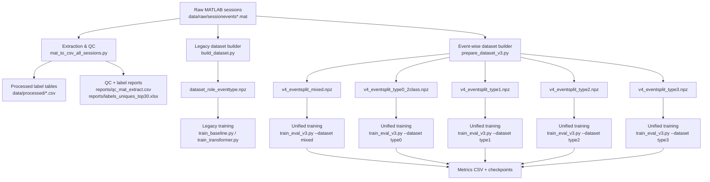

# EEG-Card-game

End-to-end EEG decoding pipeline for a multiplayer card-game setting. The project loads MATLAB session files, builds supervised learning datasets at **player-event level**, and trains CNN / Transformer classifiers to predict each player role in an event (`played`, `next/current`, `observer`).

---

## 1) What this project does

At a high level, the repository supports three workflows:

1. **Data extraction & quality checks** from raw `.mat` sessions (`data/raw/sessioneventsXX.mat`).
2. **Dataset creation** into `.npz` files for model training (both legacy and newer event-wise split versions).
3. **Model training and evaluation** for CNN and Transformer baselines with metrics + checkpoints.

The dataset is converted into samples shaped like EEG tensors per player and event, then mapped to role labels:

- `0 = played` (the player who just played)
- `1 = next/current` (the player whose turn is current/next)
- `2 = observer` (other player)

---

## 2) Repository map

```text
EEG-Card-game/
├─ scripts/
│  ├─ mat_to_csv_all_sessions.py      # extract labels/QC from raw MAT sessions
│  ├─ inspect_labels.py               # inspect label columns from a sample session
│  ├─ guess_label_mapping.py          # heuristic mapping checks for label columns
│  ├─ build_dataset.py                # legacy dataset builder -> dataset_role_eventtype.npz
│  ├─ prepare_dataset_v3.py           # event-wise split dataset builder (v4_eventsplit_*.npz)
│  ├─ train_baseline.py               # legacy CNN baseline on dataset_role_eventtype.npz
│  ├─ train_transformer.py            # legacy transformer experiment pipeline
│  ├─ train_eval_v3.py                # unified CNN/Transformer training on v4 event-wise data
│  ├─ detect_delayed_prompts.py       # sequence analysis helper
│  ├─ inspect_table_full_sequences.py # sequence analysis helper
│  └─ summarize_sequences.py          # sequence report summarizer
├─ src/
│  └─ data_loading.py                 # simple MATLAB loader helper
├─ notebooks/
│  ├─ 02_cnn_baseline.ipynb
│  └─ 03_eegnet.ipynb
├─ reports/                           # generated CSV/XLSX analysis reports
├─ requirements.txt
└─ README.md
```

---

## 3) Architecture diagram



---

## 4) Data assumptions and shapes

From the scripts, expected MAT contents are:

- `data`: EEG array shaped `(T, C, P, E)`
  - `T` = time points (often 801)
  - `C` = channels (often 32)
  - `P` = players (3)
  - `E` = events/trials
- `labels`: `(E, 8)` metadata table per event
- `t`: time vector

Model-ready samples are converted to `(N, C, T)` and labels to `(N,)`.

---

## 5) Installation

### 5.1 Prerequisites

- Python 3.9+ recommended
- (Optional) GPU for faster PyTorch training

### 5.2 Setup

```bash
# 1) Clone
git clone <your-repo-url>
cd EEG-Card-game

# 2) Create virtual environment (example)
python -m venv .venv
source .venv/bin/activate   # Windows: .venv\Scripts\activate

# 3) Install dependencies
pip install -r requirements.txt

# 4) (Recommended) install PyTorch explicitly if not already available
# See https://pytorch.org/get-started/locally/ for your CUDA/CPU build.
```

### 5.3 Quick environment check

```bash
python check_tf.py
python -c "import torch; print('torch ok:', torch.__version__)"
```

---

## 6) How to run the project (recommended order)

## Step A — Put raw files in place

Place files like `sessionevents01.mat ... sessionevents22.mat` inside:

```text
data/raw/
```

## Step B — Extract labels + quality reports

```bash
python scripts/mat_to_csv_all_sessions.py
```

Outputs include:

- `data/processed/all_sessions_labels.csv`
- `reports/qc_mat_extract.csv`
- `reports/labels_uniques_top30.xlsx`

## Step C — Build modeling dataset

### Option 1 (newer, preferred): event-wise split datasets

```bash
python scripts/prepare_dataset_v3.py
```

Expected outputs:

- `data/processed/v4_eventsplit_mixed.npz`
- `data/processed/v4_eventsplit_type0_2class.npz`
- `data/processed/v4_eventsplit_type1.npz`
- `data/processed/v4_eventsplit_type2.npz`
- `data/processed/v4_eventsplit_type3.npz`

### Option 2 (legacy): single combined dataset

```bash
python scripts/build_dataset.py
```

Expected output:

- `data/processed/dataset_role_eventtype.npz`

## Step D — Train and evaluate models

### Unified trainer (newer)

CNN on mixed dataset:

```bash
python scripts/train_eval_v3.py --model cnn --dataset mixed --epochs 30
```

Transformer on event type 1 with class weights:

```bash
python scripts/train_eval_v3.py \
  --model transformer \
  --dataset type1 \
  --epochs 40 \
  --batch_size 64 \
  --use_class_weights
```

This script logs metrics to:

- `data/processed/train_eval_v4_eventsplit_results.csv`
- `data/processed/checkpoints/`

### Legacy trainers

```bash
python scripts/train_baseline.py
python scripts/train_transformer.py
```

---

## 7) Sequence-analysis utilities

If you are analyzing event timing/prompt behavior:

```bash
python scripts/detect_delayed_prompts.py
python scripts/inspect_table_full_sequences.py
python scripts/summarize_sequences.py
```

Outputs are written to `reports/`.

---

## 8) Current project status and caution

Several Python files in this repository currently contain unresolved Git merge markers (`<<<<<<<`, `=======`, `>>>>>>>`). This can break execution until conflicts are cleaned.

If a script fails with syntax errors, first search and resolve markers:

```bash
rg -n "^(<<<<<<<|=======|>>>>>>>)" scripts src
```

After cleanup, rerun the pipeline steps above.

---

## 9) Typical experiment loop

1. Place/update raw MAT sessions.
2. Run extraction + QC (`mat_to_csv_all_sessions.py`).
3. Build event-wise dataset (`prepare_dataset_v3.py`).
4. Train a baseline (`train_eval_v3.py --model cnn ...`).
5. Train transformer variant.
6. Compare Macro-F1 / Balanced Accuracy in results CSV.
7. Plot results with `plot_results.py` (or notebook).

---

## 10) Troubleshooting

- **`No sessionevents*.mat found`**: verify files are in `data/raw/`.
- **Missing packages**: reinstall using `pip install -r requirements.txt`.
- **PyTorch import failure**: install PyTorch separately for your platform.
- **Syntax errors with `<<<<<<<`**: resolve merge conflicts in scripts before running.

---

## 11) Future README improvements (optional)

- Add a sample command with fixed random seed for reproducible benchmark.
- Add expected metric table from the latest best runs.
- Add figure artifacts directly in README once stable results are available.

